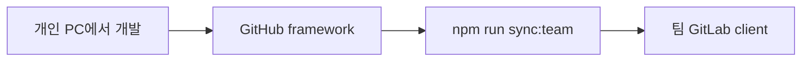

# Framework → 팀 Git 동기화 가이드

개인 GitHub 저장소([yheun03/singil-bmc](https://github.com/yheun03/singil-bmc))에서 개발한 내용을, 팀 GitLab 저장소(`devops/client`)에 **커밋 이력·메시지까지 그대로** 반영하기 위한 절차입니다.

클론을 받은 **로컬 경로는 PC마다 달라도** 됩니다. 스크립트가 `git` 저장소 루트를 자동으로 찾습니다.

### 팀 반영 브랜치

| 브랜치                           | 용도                           |
| -------------------------------- | ------------------------------ |
| `main` (GitHub framework)        | 개인 개발·푸시                 |
| **`feature/yh.eun`** (팀 GitLab) | 팀 공유·MR용 (**여기에 push**) |

`master`에는 push하지 않습니다. 스크립트 기본값도 `feature/yh.eun`입니다.

---

## 저장소 역할

| 저장소             | URL (예시)                                    | 역할                                        |
| ------------------ | --------------------------------------------- | ------------------------------------------- |
| **개인 framework** | `https://github.com/yheun03/framework.git`    | 평소 개발·커밋·푸시하는 곳                  |
| **팀 client**      | `https://git.jonsoft.co.kr/devops/client.git` | 팀 공유용. 개인 repo 내용을 주기적으로 이관 |



---

## 개인 레포에 추가해야 하는 파일

아래 **2가지**를 개인 framework 저장소에 넣고, GitHub에 **커밋·푸시**해 두어야 합니다.  
팀 쪽에서 `sync:team`을 실행할 때 이 파일들도 함께 내려받습니다.

### 1. `scripts/sync-team-repo.mjs`

동기화를 수행하는 Node 스크립트입니다. 저장소 루트 기준으로 동작합니다.

### 2. `package.json` — `scripts` 항목 추가

`package.json`의 `"scripts"` 블록에 다음 두 줄이 있어야 합니다.

```json
"sync:team": "node scripts/sync-team-repo.mjs",
"sync:team:init": "node scripts/sync-team-repo.mjs --init"
```

> 이미 프로젝트에 포함되어 있다면, 개인 레포에서 한 번만 커밋·푸시하면 됩니다.

### 개인 레포에 반영하는 방법 (최초 1회)

개인 framework 저장소 루트에서:

```bash
# 파일이 있는지 확인
ls scripts/sync-team-repo.mjs
grep sync:team package.json

# 커밋 & GitHub 푸시
git add scripts/sync-team-repo.mjs package.json
git commit -m "chore: 팀 Git 주간 동기화 npm 스크립트 추가"
git push origin main
```

이 단계를 건너뛰면, 팀 클론에서 `npm run sync:team` 실행 시 **스크립트가 없어지거나** 동기화 후 삭제될 수 있습니다.

---

## npm 명령어 요약

| 명령                     | 언제 쓰나            | 하는 일                                                                 |
| ------------------------ | -------------------- | ----------------------------------------------------------------------- |
| `npm run sync:team`      | **매주·수시**        | GitHub framework 최신을 가져와 `feature/yh.eun` 브랜치·작업 트리를 맞춤 |
| `npm run sync:team:init` | **팀 클론 최초 1회** | 팀 저장소 파일·`.git` 이력을 framework 기준으로 **통째 교체**           |

선택 환경 변수:

| 변수                  | 기본값                                     | 설명                                       |
| --------------------- | ------------------------------------------ | ------------------------------------------ |
| `FRAMEWORK_REPO`      | `https://github.com/yheun03/framework.git` | 개인 framework URL                         |
| `FRAMEWORK_BRANCH`    | `main`                                     | 가져올 브랜치                              |
| `TEAM_BRANCH`         | `feature/yh.eun`                           | 팀 저장소에서 맞출 브랜치                  |
| `KEEP_NODE_MODULES=1` | (없음)                                     | 설정 시 `git clean` 때 `node_modules` 유지 |

```bash
# node_modules 재설치를 피하고 싶을 때
KEEP_NODE_MODULES=1 npm run sync:team
```

---

## 전체 작업 순서

### 0단계 — 사전 준비 (한 번만)

- Node.js **20 이상** (`package.json` engines 참고)
- 팀 GitLab 계정·접근 권한
- 개인 GitHub framework 저장소에 위 **스크립트 2종** 커밋·푸시 완료

---

### 1단계 — 평소: 개인 레포에서 개발

```bash
cd /원하는/경로/framework   # 개인 클론 경로는 자유

npm install
npm run dev

# 작업 후
git add .
git commit -m "feat: ..."
git push origin main
```

개발·커밋·푸시는 **항상 GitHub framework**에서만 진행합니다.

---

### 2단계 — 팀 Git 클론 (최초 1회)

팀 저장소를 로컬에 받습니다. **경로는 팀원마다 달라도 됩니다.**

```bash
git clone https://git.jonsoft.co.kr/devops/client.git
cd client   # 예: /Users/me/work/client 등 임의 경로

npm install
```

`origin`이 팀 GitLab URL인지 확인합니다.

```bash
git remote -v
# origin  https://git.jonsoft.co.kr/devops/client.git (fetch)
```

---

### 3단계 — 팀 클론 최초 이관 (`sync:team:init`)

팀 저장소가 **아직 예전 구조**이거나, framework 이력으로 **처음 맞출 때** 한 번만 실행합니다.

```bash
cd /팀/client/클론/경로

npm run sync:team:init
```

동작 요약:

1. GitHub에서 framework를 임시 클론
2. 팀 클론의 기존 파일·`.git` 제거 후 framework 이력으로 교체
3. `origin`은 **팀 GitLab URL 유지**
4. `framework` remote 추가 후 `feature/yh.eun` ← `framework/main` 정렬

완료 후 로컬 `feature/yh.eun`에 framework 커밋 이력이 올라와 있어야 합니다.

```bash
git log --oneline -5
git rev-list --count HEAD
```

---

### 4단계 — 팀 서버에 반영 (최초 이관 직후)

로컬 이력이 팀 서버와 완전히 다르므로 **force push**가 필요합니다.

```bash
git push -u origin feature/yh.eun --force
```

> 팀 공유 브랜치는 **`feature/yh.eun`** 입니다. `master`에 push하지 마세요.

---

### 5단계 — 매주(또는 이관할 때마다) 반복

개인 repo에 푸시한 뒤, **팀 클론**에서:

```bash
cd /팀/client/클론/경로

# 1) framework 최신 반영
npm run sync:team

# 2) 상태 확인
git status
git log --oneline -3

# 3) 팀 GitLab에 올리기
git push origin feature/yh.eun --force
```

`sync:team` 내부 동작:

1. `origin` URL(팀 Git) 저장
2. `framework` remote로 GitHub fetch
3. `feature/yh.eun`을 `framework/main`과 동일 커밋으로 `reset --hard`
4. 추적되지 않은 파일 정리 (`git clean -fdx`)
5. `origin` URL이 바뀌었으면 팀 URL로 복구

---

## 한 주기 체크리스트 (복사용)

```text
[ ] 개인 framework에서 개발·커밋·push (origin main)
[ ] 팀 client 클론으로 이동
[ ] npm run sync:team
[ ] git log / git status 확인
[ ] git push origin feature/yh.eun --force
[ ] (필요 시) 팀원에게 반영 알림
```

---

## 자주 묻는 상황

### Q. 클론 경로가 달라도 되나요?

됩니다. `npm run sync:team`은 **현재 디렉터리가 속한 git 저장소 루트**에서 실행하면 됩니다. (`git rev-parse --show-toplevel`)

### Q. `sync:team`과 `sync:team:init` 차이는?

|             | `sync:team`            | `sync:team:init`                      |
| ----------- | ---------------------- | ------------------------------------- |
| 빈도        | 매주·수시              | 팀 클론 최초 1회                      |
| `.git` 교체 | 아니오 (fetch + reset) | 예 (framework `.git` 기준으로 재구성) |
| 속도        | 빠름                   | 느림 (전체 클론)                      |

이미 `init`으로 맞춘 뒤에는 **`sync:team`만** 쓰면 됩니다.

### Q. `sync:team` 후에 추가한 로컬 파일이 사라졌어요

`git reset --hard`와 `git clean -fdx` 때문에 **GitHub framework에 없는 파일**은 제거됩니다.  
팀에 반영할 변경은
반드시 **개인 repo에 먼저 커밋·푸시**하세요.

### Q. `node_modules`를 매번 지우기 싫어요

```bash
KEEP_NODE_MODULES=1 npm run sync:team
```

의존성이 바뀌었다면 그때만 `npm install`을 다시 실행하세요.

### Q. 팀 `origin`이 GitHub로 바뀌었어요

`sync:team` / `sync:team:init`은 실행 전 `origin` URL을 읽어 두었다가 끝에 다시 팀 URL로 맞춥니다.  
그래도 이상하면:

```bash
git remote set-url origin https://git.jonsoft.co.kr/devops/client.git
```

### Q. force push가 무서워요

`feature/yh.eun` 이력을 framework 최신으로 **덮어쓰는** 작업이라 필요합니다.  
팀원과 **동기화 타이밍**을 맞추거나, 팀 정책에 맞는 브랜치 전략을 쓰세요.

---

## 관련 파일

| 파일                         | 설명                                            |
| ---------------------------- | ----------------------------------------------- |
| `scripts/sync-team-repo.mjs` | 동기화 스크립트 본체                            |
| `package.json`               | `sync:team`, `sync:team:init` npm 스크립트 정의 |
| `project_note.md`            | 프로젝트 구조·개발 규칙                         |

---

## 개발 서버 실행 (참고)

동기화와 별개로, 로컬에서 앱을 띄울 때:

```bash
npm install
npm run dev
```

GitHub Pages 배포: `npm run generate:gh-pages`  
자세한 구조는 `project_note.md`를 참고하세요.
